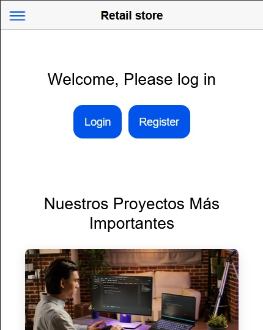
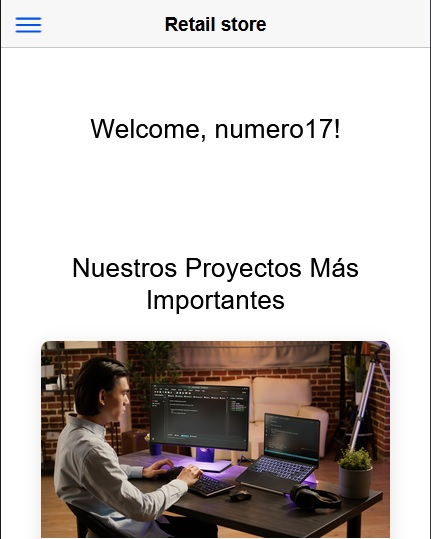
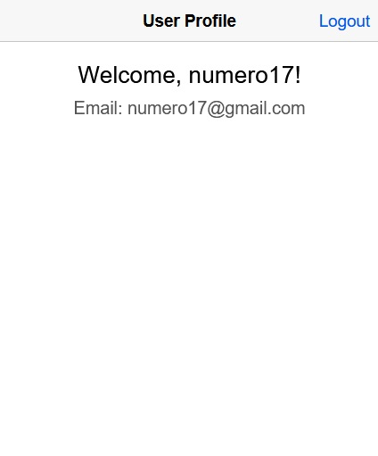
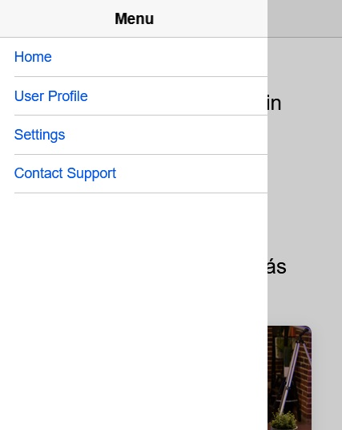
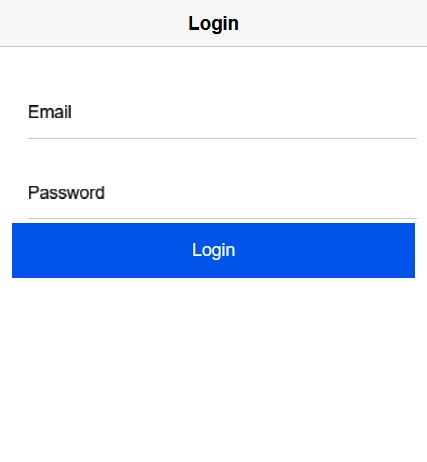

# Retail Store App

## Descripción

La **Retail Store App** es una aplicación desarrollada en Ionic y Angular que permite a los usuarios gestionar su perfil, visualizar información de proyectos importantes de la tienda, y realizar acciones como iniciar sesión, registrarse o cerrar sesión. Los datos de usuarios y proyectos están almacenados en **Firebase Firestore**.

## Características

- **Gestión de usuarios**: 
  - Inicio de sesión y registro de usuarios.
  - Logout para cerrar la sesión de manera segura.
  - Visualización de perfil con detalles del usuario (nombre y correo electrónico).
  - Datos almacenados en **Firebase Firestore**.

- **Proyectos importantes**:
  - Sección que muestra los proyectos destacados de la tienda retail con imágenes y descripciones.
  - Los proyectos están almacenados en **Firebase Firestore**.

- **Diseño responsive**:
  - El diseño se adapta tanto a dispositivos móviles como a pantallas grandes.
  - Menú desplegable para facilitar la navegación.

## Capturas de pantalla

A continuación algunas capturas de pantalla de la aplicación:

### Pantalla de inicio


### Pantalla de inicio usuario


### Perfil del usuario


### Menu


### Login


## Instalación

1. Clonar el repositorio:
    ```bash
    git clone https://github.com/usuario/retail-store-app.git
    ```

2. Navegar a la carpeta del proyecto:
    ```bash
    cd retail-store-app
    ```

3. Instalar las dependencias:
    ```bash
    npm install
    ```

4. Configurar Firebase:
    - Ve a [Firebase Console](https://console.firebase.google.com/) y crea un proyecto nuevo.
    - Configura Firestore en tu proyecto.
    - En el archivo `environment.ts`, agrega tus credenciales de Firebase.

    ```typescript
    export const environment = {
      production: false,
      firebaseConfig: {
        apiKey: "your-api-key",
        authDomain: "your-auth-domain",
        projectId: "your-project-id",
        storageBucket: "your-storage-bucket",
        messagingSenderId: "your-messaging-sender-id",
        appId: "your-app-id",
      }
    };
    ```

5. Ejecutar la aplicación:
    ```bash
    ionic serve
    ```

## Futuras mejoras

- **Autenticación avanzada**: Implementación de autenticación segura utilizando Firebase Authentication.
- **Mejora de la seguridad**: Se implementará seguridad adicional utilizando JWT.
- **Ampliación de funcionalidades**: Agregar la capacidad de interactuar con los proyectos (comentarios, likes, etc.).

## Contribución

Si deseas contribuir al proyecto, por favor, sigue estos pasos:

1. Haz un fork del proyecto.
2. Crea una nueva rama (`git checkout -b feature/nueva-caracteristica`).
3. Realiza tus cambios y haz commit (`git commit -m 'Agregar nueva característica'`).
4. Sube los cambios a tu rama (`git push origin feature/nueva-caracteristica`).
5. Abre un Pull Request.

## Licencia

Este proyecto está bajo la licencia MIT.
